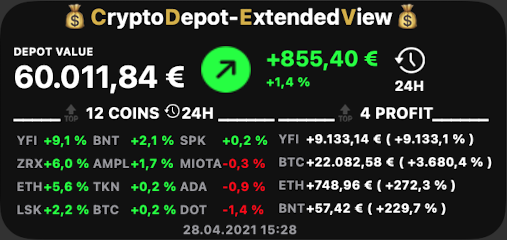
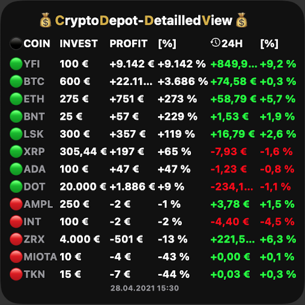

# CryptoWidget
A JavaScript for Scriptable, showing your personal crypto-balances in a widget!

[](https://img.shields.io/github/last-commit/martlgap/CryptoWidget)
[](https://img.shields.io/badge/license-CC0-blue)
[](https://img.shields.io/badge/version-0.1-purple)
[](https://img.shields.io/badge/plugin-scriptable-blue)


## 📗 Description
A JavaScript to create your own widget in the [Scriptable App](https://scriptable.app/), which shows your balances in cryptocoins. It uses the [CryptoCompare](https://cryptocompare.com) API to retrieve current prices for the currencies. 
You can feed it with your personal balances of multiple coins. Have your depot always on screen!


## 🖥 Preview
|Small|Medium|Large|
--- | --- | ---
||||


## 🛠 How to install
### iOS
- Download the [Scriptable App](https://apps.apple.com/de/app/scriptable/id1405459188).
- Open the Scriptable App and create a new script (+Button in the top-right corner).
- Name your script for example "MyCryptoWidget" by simply tapping on "Untitled Script" in the top of the sreen.
- Copy&Paste the code [cryptowidget.js](https://raw.githubusercontent.com/Martlgap/CryptoWidget/main/cryptowidget.js) code into the App and press "done".
- Go to your home-screen and add a new widget.
- Select the Scriptable App and choose the size of the widget.
- Press "Add Widget" and back on your home-screen press on the newly added widget-space.
- Select your script, choose what happens when interacting and paste your balances (see below) into the <parameter> field.


## 🍼 How to feed your balances to the Widget
Copy&Paste a JSON formated string into the parameter-field of your widget.
For example:
```json
[{"Currency":"BTC", "Amount":"0.0999", "Invest":"999"}, {"Currency":"ETH", "Amount":"0.0999", "Invest":"999"}]
```


## ☑️ TODOS
- [x] ~~Create medium and large widgets~~
- [x] ~~Add win/loss compared to last refresh~~
- [x] ~~Add a refresh date~~
- [x] ~~In large widget show all balances~~
- [x] ~~In medium widget show TOP 3 balances~~
- [x] ~~Add and highlight most profitable coin~~
- [ ] Automatically reduce text size if long number

You are very welcome to submit new ideas, feature-request and issues!


## 🔍 Find more widgets on
- [https://www.scriptables.de/](https://www.scriptables.de/)
- [https://github.com/dersvenhesse/awesome-scriptable](https://github.com/dersvenhesse/awesome-scriptable)
