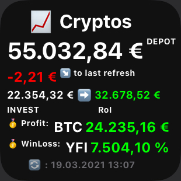

# CryptoDepotWidget
A JavaScript for Scriptable, showing your personal crypto-balances in a widget!

[](https://img.shields.io/github/last-commit/martlgap/CryptoWidget)
[](https://img.shields.io/badge/license-CC0-blue)
[](https://img.shields.io/badge/version-0.1-purple)
[](https://img.shields.io/badge/plugin-scriptable-blue)

## 📗 Description
A JavaScript to create your own widget in the [Scriptable App](https://scriptable.app/), which shows your balances in cryptocoins. It uses the [CryptoCompare](https://cryptocompare.com) API to retrieve current prices for the currencies. 
You can feed it with your personal balances of multiple coins. Have your depot always on screen!

## 🖥 What it looks like


## 🛠 How to install
### iOS
- Download the [Scriptable App](https://apps.apple.com/de/app/scriptable/id1405459188).
- Open the Scriptable App and create a new script (+Button in the top-right corner).
- Rename your script to "CryptoWidget" by simply tapping on "Untitled Script".
- Copy&Paste the [cryptowidget.js](https://raw.githubusercontent.com/Martlgap/CryptoWidget/main/cryptowidget.js) code into the App and press "done".
- Go to your home-screen and add a new widget.
- Select the Scriptable App and choose the size of the widget.
- Press "Add Widget" and back on your home-screen press on the newly added widget-space.
- Select your script, choose what happens when interacting and paste your balances into the parameter field.

### Android
TODO

## 🍼 How to feed your balances to the Widget
Copy&Paste a JSON formated string into the parameter-field of your widget.
For example:
```json
[{"Currency":"BTC", "Amount":"0.0999", "Invest":"999"}]
```

## ☑️ TODOS
- [ ] Create medium and large widgets
- [x] Add win/loss compared to last refresh
- [x] Add a refresh date
- [ ] In large widget show all balances
- [ ] In medium widget show TOP 3 balances
- [x] Add and highlight most profitable coin

## 🔍 Find more widgets on
[https://www.scriptables.de/](https://www.scriptables.de/)
