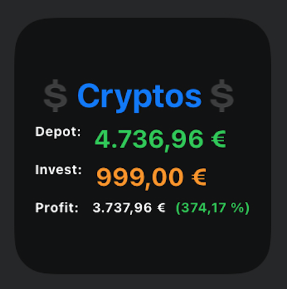

# CryptoWidget
Showing your personal Crypto-Balances in a Widget!

## 🖥What it looks like


## How to install
### iOS
- Download the [Scriptable App](https://apps.apple.com/de/app/scriptable/id1405459188).
- Open Scriptable and open a new Script (+Button in the top-right corner).
- Rename your Script to "CryptoWidget" by simply tapping on "Untitled Script".
- Copy&Paste the [cryptowidget.js](https://raw.githubusercontent.com/Martlgap/CryptoWidget/main/cryptowidget.js) code into the App and press "done".
- Go to your Homescreen and add a new Widget.
- Select the Scriptable App and choose the size of the Widget.
- Press "Add Widget" and back on your Homescreen press on the newly added Widget-Space.
- Select your Script, choose what happens when interacting and paste your balances into the Parameter field.

### Android
TODO

## 🍼How to feed your balances to the Widget
Copy&Paste a JSON formated string into the Parameter-Field of your Widget.
For example:
```json
{"Currency":"BTC", "Amount":"0.0999", "Invest":"999"}
```
